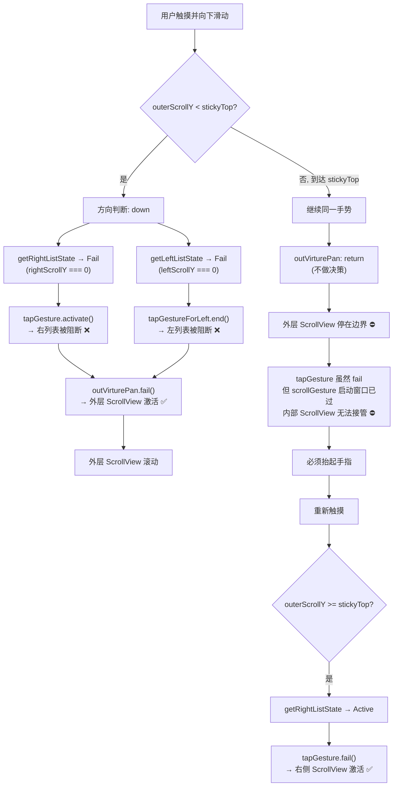

# 嵌套 ScrollView 手势协调机制分析

## 一、整体架构

该 Demo 实现了一个**三层级联滚动**结构：外层 ScrollView → 左/右两个内部 ScrollView，通过 `react-native-gesture-handler` 的手势拦截机制精确控制滚动权。

### 视图层级

```
GestureHandlerRootView
└── Animated.View (全屏容器, paddingTop: 88)
    └── GestureDetector (Simultaneous: outVirturePan, tapGesture, tapGestureForLeft)
        └── Animated.View (flex: 1)
            └── GestureDetector (Simultaneous: outScrollGesture)
                └── Animated.ScrollView ← 外层 ScrollView
                    ├── View (顶部 20 个 Text)
                    └── Animated.View (stickyTop 分界线, flexDirection: 'row')
                        ├── GestureDetector (leftScrollGesture)
                        │   └── Animated.ScrollView ← 左侧 ScrollView
                        │       └── 100 个 TapGestureHandler + Text
                        ├── View (分隔线)
                        └── View (flex: 1)
                            ├── Animated.View (LOADING 提示, translateY 动画)
                            └── GestureDetector (scrollGesture)
                                └── Animated.ScrollView ← 右侧 ScrollView
                                    └── 100 个 Text
```

### 手势架构

```
┌──────────────────────────────────────────────────────────────┐
│              Gesture.Simultaneous (顶层同时监听)               │
│       (outVirturePan, tapGesture, tapGestureForLeft)         │
├───────────────┬──────────────────┬───────────────────────────┤
│ outVirturePan │   tapGesture     │  tapGestureForLeft        │
│ 外层拦截器     │   右列表拦截器    │  左列表拦截器              │
│  ↓ fail()?    │    ↓ fail()?     │   ↓ fail()?               │
│ outScroll-    │  scrollGesture   │  leftScroll-              │
│ Gesture       │                  │  Gesture                  │
│ 外层 Native   │  右列表 Native    │  左列表 Native             │
│  ↓ 激活?      │  ↓ 激活?         │  ↓ 激活?                  │
│ 外层 Scroll   │  右 ScrollView   │  左 ScrollView            │
│ View          │                  │                           │
└───────────────┴──────────────────┴───────────────────────────┘
```

### 关键共享状态

| 变量 | 类型 | 含义 |
|------|------|------|
| `stickyTop` | `useSharedValue(0)` | 分界线 Y 坐标（顶部 View 的高度），通过 `onLayout` 赋值 |
| `outerScrollY` | `useSharedValue(0)` | 外层 ScrollView 当前滚动偏移 |
| `rightScrollY` | `useSharedValue(0)` | 右侧 ScrollView 当前滚动偏移 |
| `leftScrollY` | `useSharedValue(0)` | 左侧 ScrollView 当前滚动偏移 |
| `panPosition` | `useSharedValue<E_PanPosition>` | 当前触摸位置：左侧 / 右侧 |
| `rightListScrollState` | `useSharedValue<E_ListScrollState>` | 右列表当前可滚动状态 |
| `leftListScrollState` | `useSharedValue<E_ListScrollState>` | 左列表当前可滚动状态 |

---

## 二、核心设计：拦截器 + requireExternalGestureToFail

### 2.1 拦截器手势的通用配置

三个拦截器手势 (`outVirturePan`, `tapGesture`, `tapGestureForLeft`) 都有以下配置：

```typescript
.manualActivation(true)   // 不自动激活，只在 onTouchesMove 中手动调用 manager.activate() / manager.fail()
.minDistance(99999)        // 正常滑动距离永远无法触发，确保只做"裁判"不做"选手"
```

### 2.2 requireExternalGestureToFail 的作用

```typescript
const outScrollGesture = Gesture.Native()
    .requireExternalGestureToFail(outVirturePan)    // 等待 outVirturePan 失败后，外层 ScrollView 才能滚动

const scrollGesture = Gesture.Native()
    .requireExternalGestureToFail(tapGesture)       // 等待 tapGesture 失败后，右侧 ScrollView 才能滚动

const leftScrollGesture = Gesture.Native()
    .requireExternalGestureToFail(tapGestureForLeft) // 等待 tapGestureForLeft 失败后，左侧 ScrollView 才能滚动
```

**语义**：`requireExternalGestureToFail(gesture)` 表示"我（Native 手势）要等 `gesture` 失败后才能激活"。

- 拦截器 **fail** → 对应 Native 手势放行 → ScrollView 可以滚动
- 拦截器 **activate** → 对应 Native 手势被阻断 → ScrollView 无法滚动

### 2.3 滚动状态判定逻辑

```typescript
enum E_ListScrollState {
    Padding = 'padding',   // 尚未确定，等待更多信息
    Active  = 'active',    // 内部列表需要自己处理滚动
    Fail    = 'fail'       // 内部列表不需要滚动，应交给外层
}
```

#### 右列表状态判定 (`getRightListState`)

| 条件 | 状态 | 含义 |
|------|------|------|
| 触摸在左侧 (`panPosition === Left`) | `Padding` | 右列表不参与判断 |
| 向上滑 + 外层未到顶 (`outerScrollY < stickyTop`) | `Fail` | 外层还没滚到顶，右列表不应接管 |
| 向上滑 + 外层已到顶 (`outerScrollY >= stickyTop`) | `Active` | 外层已到顶，右列表接管滚动 |
| 向下滑 + 右列表有偏移 (`rightScrollY > 0`) | `Active` | 右列表还没回顶部，继续自己滚 |
| 向下滑 + 右列表在顶部 (`rightScrollY <= 0`) | `Fail` | 右列表已到顶，交给外层 |

#### 左列表状态判定 (`getLeftListState`)

逻辑与右列表对称，触摸在右侧时返回 `Padding`。

---

## 三、场景详解：向下触摸滚动

### 阶段一：初始状态 → 外层 ScrollView 滚动

**初始条件**：`outerScrollY = 0`，`rightScrollY = 0`，`leftScrollY = 0`，`stickyTop ≈ 20个Text的高度`

#### outVirturePan.onTouchesMove 执行流程

1. 确定方向：`direction = 'down'`
2. 调用 `getRightListState('down')`：因为 `rightScrollY === 0` → 返回 **`Fail`**
3. 调用 `getLeftListState('down')`：因为 `leftScrollY === 0` → 返回 **`Fail`**

两个都不是 `Active`，进入条件判断：

```typescript
if (direction === 'down' && outerScrollY.value <= stickyTop.value) {
    if (rightScrollY.value <= 0 && outerScrollY.value < stickyTop.value) {
        manager.fail()   // ← outVirturePan 失败
    }
}
```

**`outVirturePan` 调用 `manager.fail()` → 失败！**

→ `outScrollGesture` 的 `requireExternalGestureToFail(outVirturePan)` 条件满足 → **外层 ScrollView 激活** ✅

#### tapGesture.onTouchesMove 执行流程

```typescript
const state = getRightListState('down')  // 返回 Fail
if (state === E_ListScrollState.Active) {
    manager.fail()
} else {
    manager.activate()   // ← tapGesture 主动激活
}
```

**`tapGesture` 激活** → `scrollGesture` 的 `requireExternalGestureToFail(tapGesture)` 条件不满足 → **右侧 ScrollView 被阻断** ❌

#### tapGestureForLeft.onTouchesMove 执行流程

同理，`getLeftListState('down')` 返回 `Fail` → `manager.end()`（相当于激活效果）→ **左侧 ScrollView 被阻断** ❌

**结果：只有外层 ScrollView 在滚动。**

---

### 阶段二：外层滚动到达 stickyTop → 滚动停止

当 `outerScrollY >= stickyTop` 时，外层 ScrollView 已经滚到了分界线。由于 `bounces={false}`，外层无法继续向上滚动。

#### 如果用户手指不抬起继续滑动

**outVirturePan.onTouchesMove**：

```typescript
if (direction === 'up' && outerScrollY.value >= stickyTop.value) {
    return   // ← 直接 return，既不 fail 也不 activate
}
// ...
manager.fail();  // 不会走到这里
```

`outVirturePan` 既没有 `fail()` 也没有 `activate()` → `outScrollGesture` 一直在等待 → 外层 ScrollView 不响应新事件。

**tapGesture.onTouchesMove**：

```typescript
const state = getRightListState('up')
// outerScrollY >= stickyTop → 返回 Active
if (state === E_ListScrollState.Active) {
    manager.fail()   // ← tapGesture 失败
}
```

`tapGesture` 失败 → `scrollGesture` 的等待条件满足 → 理论上右侧 ScrollView 可以滚动。

**但实际上无法在同一触摸序列中接管滚动**（见下一节）。

---

### 阶段三：为什么必须抬起手指重新触摸？

这是最关键的一点。虽然从逻辑上 `tapGesture` 已经 fail，`scrollGesture` 满足了激活条件，但 **`scrollGesture` 无法在同一个触摸序列中激活**。

#### 原因：requireExternalGestureToFail 的时机限制

> **`requireExternalGestureToFail` 只在手势识别的开始阶段生效。** 它决定的是"在触摸开始时，我要等另一个手势失败后才开始"。一旦一个 Native 手势已经错过了启动窗口，它就无法在中途接管。

具体到本场景：

1. 用户触摸开始 → 手势系统同时启动所有手势的识别
2. `tapGesture` 在触摸开始时就 **激活** 了（因为初始状态右列表不需要滚动）→ `scrollGesture` 被永久阻断
3. 随着滚动进行，`tapGesture` 虽然后来 fail 了，但 `scrollGesture` 的启动窗口已经过了
4. `outScrollGesture` 在阶段一已经接管了触摸事件，即使后来外层 ScrollView 到了边界无法滚动，触摸事件也不会自动转交给内部的 ScrollView

#### 抬起手指 → 重新触摸的流程

1. 新触摸开始
2. 此时 `outerScrollY >= stickyTop`
3. `getRightListState('up')` → `Active` → `tapGesture` **直接 fail**
4. `scrollGesture` 的等待条件在启动窗口内满足 → `tapGesture` **直接 fail**
4. `scrollGesture` 的等待条件在启动窗口内满足 → **右侧 ScrollView 立即获得滚动权** ✅

---

## 四、完整流程图



---

## 四、手势依赖关系总结

| 拦截器 | 监控对象 | fail → 放行 | activate → 阻断 |
|--------|---------|------------|----------------|
| `outVirturePan` | 外层 ScrollView | 外层可以滚动 | 外层无法滚动 |
| `tapGesture` | 右侧 ScrollView | 右侧可以滚动 | 右侧无法滚动 |
| `tapGestureForLeft` | 左侧 ScrollView | 左侧可以滚动 | 左侧无法滚动 |

### 手势间的 simultaneousWithExternalGesture 关系

```typescript
// tapGesture 可以与外层手势同时存在
tapGesture.simultaneousWithExternalGesture(outVirturePan, outScrollGesture)

// tapGestureForLeft 可以与外层手势同时存在
tapGestureForLeft.simultaneousWithExternalGesture(outVirturePan, outScrollGesture)
```

这确保了三个拦截器可以在同一触摸序列中同时运行，各自独立判断，互不干扰。

---

## 五、核心结论

1. **拦截手势当守门员**：通过 `manualActivation(true)` + `minDistance(99999)` 让 Pan 手势只做裁判，不参与实际滑动
2. **fail/activate 作为开关**：拦截器 `fail()` → 对应 ScrollView 放行；`activate()` → 对应 ScrollView 阻断
3. **`requireExternalGestureToFail` 只在启动窗口生效**：同一个触摸序列中，一旦 Native 手势被阻断就再也无法中途接管，这是 RNGH 的设计限制
4. **必须松手重触才能切换滚动层级**：这既是限制，也是设计选择——用"必须松手重触"的交互换取滚动不冲突的可靠性
5. **`stickyTop` 是关键分界线**：所有判断都以 `outerScrollY` 与 `stickyTop` 的比较为基础，决定内外层级谁该接管滚动
