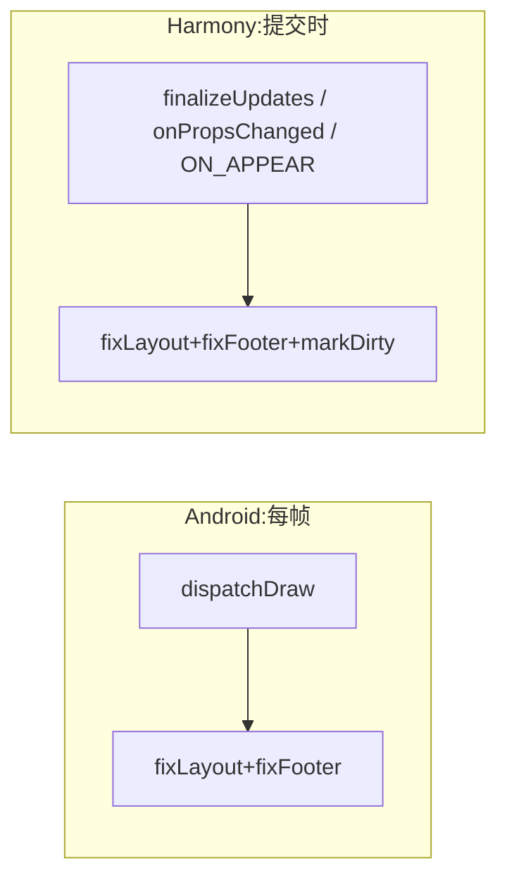

# FlashList Harmony 与 Android 实现差异分析

> 分析日期:2026-08-26
>
> 对比对象:
> - **Android**:`@shopify/flash-list@1.8.2`(上游),Kotlin 实现,位于 `node_modules/@shopify/flash-list/android/src/main/kotlin/com/shopify/reactnative/flash_list/`
> - **Harmony**:`@react-native-ohos/flash-list@1.8.3`(OpenHarmony 移植版),CAPI C++ 实现,位于 `node_modules/@react-native-ohos/flash-list/harmony/flash_list/src/main/cpp/`(JS 侧为 fork 的 `src/` 目录,经 `.harmony.ts` 平台扩展接入)
>
> 工程集成方式:`harmony/entry` 通过 `flash_list.har` 引入,`PackageProvider.cpp` 注册 `FlashListPackage`(C++/CAPI 路径);`harmony/flash_list/src/main/ets/` 下的 ArkTS 实现未注册,为遗留代码。

---

## 一、总体架构差异

| 维度 | Android(上游) | Harmony(移植版) | 评价 |
|---|---|---|---|
| 技术栈 | Kotlin `ViewManager` + Android View 体系(`ReactViewGroup`) | C++ `ComponentInstance` + ArkUI CAPI 节点(`ArkUINode`) | 架构适配,合理 |
| 注册机制 | `ReactPackage.createViewManagers()` 返回 ViewManager 列表 | `FlashListPackage` 提供 `ComponentInstanceFactoryDelegate` + `ComponentDescriptorProviders` + `ComponentJSIBinderByName` + `EventEmitRequestHandler` | 架构适配,合理 |
| 视图修正入口 | `dispatchDraw()`(每帧绘制) | `finalizeUpdates()` / `onPropsChanged()` / ArkUI `NODE_ON_APPEAR` 事件 | **行为差异,见 D1** |
| 单位体系 | View 层为物理像素,JS 下发 dp 需 `density` 转换 | RNOH/ArkUI 全程逻辑像素(vp),无需转换 | 架构适配,自洽 |
| 组件创建线程 | 主线程 | `PARALLELIZATION_ENABLE` 宏开启后 `AutoLayoutView`/`CellContainer` 支持子线程创建(`FlashListPackage.h` `getComponentCreateInSubThread`) | Harmony 独有优化 |
| 实现份数 | 一份 Kotlin | C++(生效)+ ArkTS(未注册,含 bug,见 D8) | 维护性风险 |
| 复用(回收)机制 | 100% JS 侧 `RecyclerListView`/`VirtualRenderer`,native 仅被动挂载/摘除子节点 | 同左(共享同一套 JS) | **无差异** |

---

## 二、核心差异详解

### D1. 布局修正的触发时机:每帧绘制 vs 提交时修正 【影响:正确性/性能,建议观察】

**差异**

Android 在 `AutoLayoutView.kt:36` 的 `dispatchDraw(canvas)` 中执行 `fixLayout()` + `fixFooter()`,即**每一帧绘制前**都会修正。源码注释明确说明原因:

> *"Overriding draw instead of onLayout. RecyclerListView uses absolute positions for each and every item which means that changes in child layouts may not trigger onLayout on this container."*

Harmony 侧(`AutoLayoutViewComponentInstance.cpp`)的触发点是:

| 触发点 | 时机 |
|---|---|
| `finalizeUpdates()` | RN 提交事务完成时(**仅当 `parentScrollView != nullptr`**,首次为空会被跳过,依赖 ON_APPEAR 兜底) |
| `onPropsChanged()` | JS props 更新时(滚动时 `scrollOffset` 会持续更新,覆盖大部分滚动场景) |
| `NODE_EVENT_ON_APPEAR`(`AutoLayoutNode.cpp:31`) | 节点挂载/出现时 |



**影响分析**

- **正确性**:子 Cell 尺寸异步变化(如图片加载完成后撑高)且当帧无 props 更新时,Harmony 不会立即修正,缝隙/重叠会残留到下一次任意 props 更新(滚动、数据变化)才被消除;Android 每帧兜底,不存在此窗口。实际风险中等——RLV 滚动期间 `scrollOffset` prop 更新频繁,静止时子尺寸变化较少见。
- **性能**:Harmony 触发频次显著低于 Android 每帧执行,理论开销更小,这一点是**优势**。

**建议**:暂不改动(P3 观察项)。若实测出现可见缝隙,可做两点低成本缓解:① `finalizeUpdates()` 放宽 `parentScrollView` 门槛(为空时也执行一次修正,首次由 `ON_APPEAR` 补齐引用);② 在 `onChildInserted`/`onChildRemoved` 中追加 `markDirty()` 强制重绘。完全对齐 `dispatchDraw` 需要 ArkUI 自绘事件,代价高,不建议。

---

### D2. `isWithinBounds` 判定条件:OR vs 单边 【影响:正确性,建议修复(P1)】

**差异**

- Android(`AutoLayoutShadow.kt:31`):`if (isWithinBounds(cell) || isWithinBounds(neighbour))` —— **任一**在窗口内即修正。
- Harmony(`AutoLayoutShadow.cpp:51`):`if (isWithinBounds(cell->getLayoutMetrics()))` —— 仅判断 **cell**。

**影响分析**

当相邻对中 cell 在窗口外、neighbour 在窗口内时(出现在窗口边界、`numColumns > 1`、不等高 item 场景),Harmony 跳过修正,导致**窗口边缘出现缝隙**。Android 的 OR 条件正是为了覆盖这种情况。

**修复方案**(与 D3 同函数,建议一并修改,见下方合并代码)

---

### D3. `std::optional` 空值解引用(未定义行为) 【影响:正确性/稳定性,必修(P0)】

**差异/缺陷**

`AutoLayoutShadow.cpp` 的 `clearGapsAndOverlaps()` 中,`neighbourMetrics` **只在 `isNeighbourConsecutive` 分支内被赋值**(:48 声明,:57/:78 赋值),但存在两处**无条件解引用**:

1. :69 / :90 —— `if (isWithinBounds(*neighbourMetrics))`:当相邻对**不连续**时(窗口内 index 有跳跃、sticky header 等常见场景),此处对空 `optional` 解引用,属未定义行为;
2. :98 / :102 —— 循环尾部的 `neighbourMetrics->frame.origin...`:在 `if (isWithinBounds(cell))` 块**外**,任何非连续对都会执行。垂直分支中该值(`bottom`)还参与了 `lastMaxBoundOverall` 的 MAX 计算 → `lastMaxBoundOverall` 可能取到垃圾值 → `getFooterDiff()` 返回错误结果 → **footer 及容器尺寸错位、闪烁**;水平分支中 `float right`(:98)计算后未使用,是纯死代码。

对照:Android(`AutoLayoutShadow.kt`)直接使用 View 的真实边界 `neighbour.bottom` / `neighbour.right`,无此问题。

**修复方案(D2 + D3 合并)**

```cpp
// AutoLayoutShadow.cpp — clearGapsAndOverlaps() 核心循环修正版
for (int i = 0; i < sortedItems.size() - 1; i++) {
    auto cell = sortedItems[i];
    auto neighbour = sortedItems[i + 1];
    auto neighbourOriginal = neighbour->getLayoutMetrics();          // 始终持有原始值
    std::optional<facebook::react::LayoutMetrics> neighbourMetrics;
    bool isNeighbourConsecutive = neighbour->getIndex() == cell->getIndex() + 1;

    // [D2] 对齐 Android 的 OR 条件:cell 或 neighbour 任一在窗口内即修正
    if (isWithinBounds(cell->getLayoutMetrics()) ||
        isWithinBounds(neighbourOriginal)) {
        if (!horizontal) {
            maxBound = MAX(maxBound, cell->getBottom());
            minBound = MIN(minBound, cell->getTop());
            maxBoundNeighbour = maxBound;
            if (isNeighbourConsecutive) {
                neighbourMetrics = neighbourOriginal;
                // ……原有修正逻辑保持不变……
            }
            // [D3] 判空后再解引用
            if (neighbourMetrics.has_value() && isWithinBounds(*neighbourMetrics)) {
                float bottom = neighbourMetrics->frame.origin.y + neighbourMetrics->frame.size.height;
                maxBoundNeighbour = MAX(maxBound, bottom);
            }
        } else {
            // ……horizontal 分支同理……
        }
    }
    // [D3] 循环尾部:与 Android 一致,统一使用 neighbour 真实边界,删除死代码 right/bottom
    lastMaxBoundOverall = MAX(lastMaxBoundOverall,
        horizontal ? cell->getRight() : cell->getBottom());
    lastMaxBoundOverall = MAX(lastMaxBoundOverall,
        horizontal ? neighbour->getRight() : neighbour->getBottom());

    cell->setLayout(cell->getLayoutMetrics());
    neighbour->setLayout(neighbourMetrics.value_or(neighbourOriginal));
}
```

改动量小、逻辑与 Android 对齐,风险低,建议优先合入。

---

### D4. 非 CellContainer 子元素的处理:快速失败 vs 空指针崩溃 【影响:稳定性,必修(P0)】

**差异**

- Android(`AutoLayoutView.kt:51-59`):`fixLayout()` 中发现非 `CellContainer` 子视图时**抛出 `IllegalStateException`**,并附带指引文档链接,快速失败、易于定位。
- Harmony(`AutoLayoutViewComponentInstance.cpp` `fixLayout()`):`dynamic_pointer_cast` 失败得到 `nullptr` 后**静默 push 进 `childrenView`**,随后:

```cpp
std::sort(childrenView.begin(), childrenView.end(),
          [](auto &a, auto &b) { return a->getIndex() < b->getIndex(); }); // 对 nullptr 解引用 → SIGSEGV
```

另外 `getFooterDiff()` 的单子节点分支对 `firstChild->getRight()/getBottom()` 同样未判空。

**影响分析**

当业务侧错误覆盖 `CellRendererComponent`(外层视图不是 `CellContainer`)或异常子节点插入时,Android 给出清晰报错,Harmony 直接**原生崩溃(SIGSEGV)**,且现场难以定位。

**修复方案**

```cpp
// fixLayout()
for (auto const &child : children) {
    auto cell = std::dynamic_pointer_cast<rnoh::CellContainerComponentInstance>(child);
    if (cell == nullptr) {
        // 对齐 Android 的 fail-fast 语义(文案保持一致,便于跨平台排查)
        throw std::runtime_error(
            "CellRendererComponent outer view should always be CellContainer. "
            "Learn more: https://shopify.github.io/flash-list/docs/usage#cellrenderercomponent");
    }
    childrenView.push_back(cell);
}

// getFooterDiff() 单子节点分支
} else if (getChildren().size() == 1) {
    auto firstChild = std::dynamic_pointer_cast<rnoh::CellContainerComponentInstance>(getChildren()[0]);
    if (firstChild != nullptr) {
        alShadow.lastMaxBoundOverall = alShadow.horizontal ? firstChild->getRight() : firstChild->getBottom();
    }
}
```

> 若担心 C++ 抛异常在 RNOH 侧的行为不可控,可降级为 `LOG_ERROR` + 跳过该子节点;但无论哪种,都必须消除 nullptr 进入 `std::sort` 的路径。

---

### D5. `inverted` 反转的实现:transform 翻转 vs 数据倒序 【影响:功能正确性,建议修复(P1)】

**差异**

- **Android(上游 JS)**:依赖 `PlatformConfig.invertedTransformStyle`(Android 为 `rotate: "180deg"`,规避 scaleY 性能问题,见 Shopify issue #751),在 `FlashList.tsx` 的容器 style、`itemContainer`、footer 等多处通过 `getTransform()` 展开,整体视觉镜像,**数据顺序不变**。
- **Harmony(fork JS)**:`src/FlashList.tsx:207-223` 在 `getDerivedStateFromProps` 中改为**数据倒序**:

```ts
if (nextProps.data !== prevState.data || prevState.lastInverted !== nextProps.inverted) {
    const processedData = nextProps.inverted
        ? (nextProps.data ? [...nextProps.data].reverse() : nextProps.data)
        : nextProps.data;
    ...
}
```

同时 fork 删除了 `getTransform()`/`transformStyle` 及其全部调用点;`PlatformHelper.harmony.ts` 中的 `invertedTransformStyle: { transform: [{ scaleY: -1 }] }` 沦为**死代码**。

**影响分析(功能)**

两种方案**语义不等价**,同一份业务代码两端表现不同:

| 方面 | 上游 transform 方案 | fork 数据倒序方案 |
|---|---|---|
| 视觉镜像 | 容器整体翻转,符合 `inverted` 直觉 | 仅渲染顺序颠倒,**无镜像** |
| `initialScrollIndex` / `onScrollToIndex` | 索引指向原始数据 | 索引指向倒序后数组,**与上游相反** |
| Header/Footer 视觉位置 | 随容器翻转互换 | 保持原位 |
| 增量数据滚动锚定 | 新数据 append 于数据尾部,滚动偏移稳定 | 新数据经倒序落在 index 0,RLV 锚定易失效 → **聊天列表新增消息时跳动** |
| `onEndReached` 触发端 | 视觉顶部 | 视觉底部 |

**影响分析(性能)**

每次 data 变化增加一次 O(n) 拷贝 + 倒序(`[...nextProps.data].reverse()`),大列表高频更新时有额外开销。

> 客观说明:fork 改用数据倒序的动机推测是当时 RNOH/ArkUI 对 scale/rotate 反转变换的兼容性或性能存在顾虑。若该前提已不成立(当前 ArkUI 已支持负 scale 变换),应回归上游方案。

**修复方案**

**方案 A(推荐):恢复 transform 方案**

```ts
// 1. PlatformHelper.harmony.ts 已有定义,无需改动:
// invertedTransformStyle: { transform: [{ scaleY: -1 }] }

// 2. FlashList.tsx(fork)恢复上游实现:
private transformStyle = PlatformConfig.invertedTransformStyle;
private transformStyleHorizontal = PlatformConfig.invertedTransformStyleHorizontal;

private getTransform() {
    return (this.props.inverted && this.transformStyle) || undefined;
}

// 3. render() 容器 style 恢复展开:
style={this.props.horizontal
    ? { ...this.getTransform() }
    : { flex: 1, overflow: "hidden", ...this.getTransform() }}
// itemContainer / footer 相关调用点同步恢复 ...this.getTransform()

// 4. getDerivedStateFromProps 删除数据倒序,恢复上游:
if (nextProps.data !== prevState.data) {
    newState.data = nextProps.data;
    newState.dataProvider = prevState.dataProvider.cloneWithRows(nextProps.data as any[]);
    ...
}
```

合入前需在真机验证:① `scaleY: -1` 在 ArkUI 上的滚动事件方向、触控命中区域是否正确;② sticky header、下拉刷新是否正常。若 scale 变换在 ArkUI 上有性能问题,可改用与 Android 上游一致的 `rotate: "180deg"`。

**方案 B(保守兜底)**:保留数据倒序,但针对"新增数据时滚动位置跳动"做补偿(新数据到达时主动 `scrollToOffset` 维持视觉位置)。治标不治本,索引语义偏移依旧存在,仅当方案 A 验证不通过时采用。

---

### D6. BlankArea 事件的采样时机 【影响:监控精度,无需修复(P3)】

**差异**

- Android:`dispatchDraw()` 每帧采样(开启 `enableInstrumentation` 时),滚动期间持续上报;发射时除以 `pixelDensity`(`AutoLayoutView.kt:161-162`)。
- Harmony:仅 `onAppear()`(含 props 更新驱动)时采样计算;发射时同样除以 `pixelDensity`(`AutoLayoutViewComponentInstance.cpp:204-205`)。

**影响分析**

Harmony 的上报节奏跟随 JS props 更新(滚动时 `scrollOffset` 持续更新,大体能跟随滚动),但无每帧采样,静止后不再重复上报。对 `onBlankAreaEvent` 的使用(白屏监控)精度略低,**可接受**。

> 附带发现:`AutoLayoutViewComponentInstance.h:44` 的 `pixelDensity{1.0}` 成员**从未被赋值**,恒为 1.0。这并非 bug——RNOH 全程使用逻辑像素,`blankOffsetAtStart/End` 本就是逻辑像素,除以 1.0 是无害的恒等操作(Android 必须除是因为其 Shadow 计算在物理像素域)。但作为死代码容易误导后续维护者,建议删除或注释说明。

---

### D7. JS fork 遗留调试代码 【影响:性能,必删(P2)】

`@react-native-ohos/flash-list/src/FlashList.tsx:290`(sizeProvider 内):

```ts
console.log('mutableLayout:', mutableLayout);  // 上游无此行
```

**影响分析**:sizeProvider 在**每个 item 的每次尺寸估算**时都会执行,该行在生产环境持续产生序列化与打印开销,列表越大、更新越频繁,损耗越明显。

**修复方案**:直接删除该行。

---

## 三、低风险差异与清理建议(D8)

| 项 | 说明 | 建议 |
|---|---|---|
| ArkTS 遗留实现 | `harmony/flash_list/src/main/ets/` 未注册但随 `.har` 发布,其中 `RNAutoLayoutShadow.ets:70` 存在运算符优先级 bug:`neighbour.rawProps.index === cell.rawProps.index ?? -1 + 1` 实际解析为 `(a === b) ?? 0`,连续性判断恒错(正确写法为 `cell.rawProps.index + 1`) | 从产物中移除,或修复后再保留,防止未来误启用引入回归 |
| 子线程创建日志 | `FlashListPackage.h` `getComponentCreateInSubThread()` 内有 `OH_LOG_Print` 残留 | 删除 |
| `fixFooter` 落地方式 | Android 用 `offsetLeftAndRight`/`offsetTopAndBottom` 平移;Harmony 直接改 `frame.origin`(footer)与 `frame.size`(self/parent)。两者在各自视图体系下语义等价 | 无需修改 |
| 单位转换 | Android ViewManager 将 `scrollOffset`/`windowSize`/`renderAheadOffset` 以 `dp × density` 转物理像素(`AutoLayoutViewManager.kt:53-68`);Harmony `onPropsChanged` 直接使用原始值 | 架构性差异,RNOH 全程逻辑像素,内部自洽,**无需修改**;建议在代码中加注释说明,避免后人误加转换 |

---

## 四、已核实为"非差异"的项(不计入)

| 项 | 核实结论 |
|---|---|
| ItemAnimator | 上游 Android 的 `PlatformHelper.android.ts` `getItemAnimator()` 同样返回 `undefined`,双端均使用 RLV 默认动画,行为一致 |
| `useOnNativeBlankAreaEvents` listener 清理写法 | `listeners.filter(...)` 结果未赋值的写法在**上游同样存在**,fork 忠实移植。属上游缺陷而非平台差异;升级 fork 时可顺手修复(改为 `splice` 或可变引用) |
| 复用(回收)机制 | 100% 在 JS 侧(`VirtualRenderer`/`RecycleItemPool`),双端 native 均为被动挂载/摘除,无差异 |

---

## 五、修复优先级汇总

| 优先级 | 编号 | 问题 | 类型 | 改动量 |
|---|---|---|---|---|
| **P0** | D3 | `std::optional` 空值解引用 → UB / footer 错位 | 稳定性/正确性 | 小 |
| **P0** | D4 | 非 CellContainer 子节点 → nullptr 排序崩溃 | 稳定性 | 小 |
| **P1** | D2 | `isWithinBounds` 缺失 OR 条件 → 窗口边缘缝隙 | 正确性 | 极小(随 D3 一并修) |
| **P1** | D5 | `inverted` 数据倒序方案语义偏移、新增数据滚动跳动 | 功能正确性 | 中(需真机验证) |
| **P2** | D7 | sizeProvider 内 `console.log` | 性能 | 极小 |
| **P3** | D1 | 修正触发时机非每帧 | 正确性(边缘) | 观察为主 |
| **P3** | D6 | BlankArea 采样频率较低 | 监控精度 | 不修 |
| **P3** | D8 | ArkTS 遗留 / 死代码 / 残留日志 | 维护性 | 清理 |

---

## 六、验证建议

修复后建议按以下用例回归:

1. **基础列表**:等高/不等高 item、`numColumns ∈ {1, 2, 3}`、span 覆盖(`overrideItemLayout`),检查无缝隙/重叠(覆盖 D1/D2);
2. **窗口边界**:快速滑动至列表顶/底、窗口内 index 不连续(部分 item 被回收)时,检查 footer 位置与空白区域(覆盖 D2/D3);
3. **异常子节点**:构造 `CellRendererComponent` 外层非 `CellContainer` 的用例,确认报错而非崩溃(覆盖 D4);
4. **inverted**:
   - 聊天场景:增量插入新消息,验证滚动位置不跳动;
   - `initialScrollIndex`、`onEndReached` 触发端、Header/Footer 视觉位置,与 Android 行为逐项比对(覆盖 D5);
5. **性能**:DevEco Profiler 对比删除 `console.log` 前后的滚动帧耗时(覆盖 D7);
6. **白屏监控**:`onBlankAreaEvent` 数值与实际空白区域一致性(覆盖 D6)。
